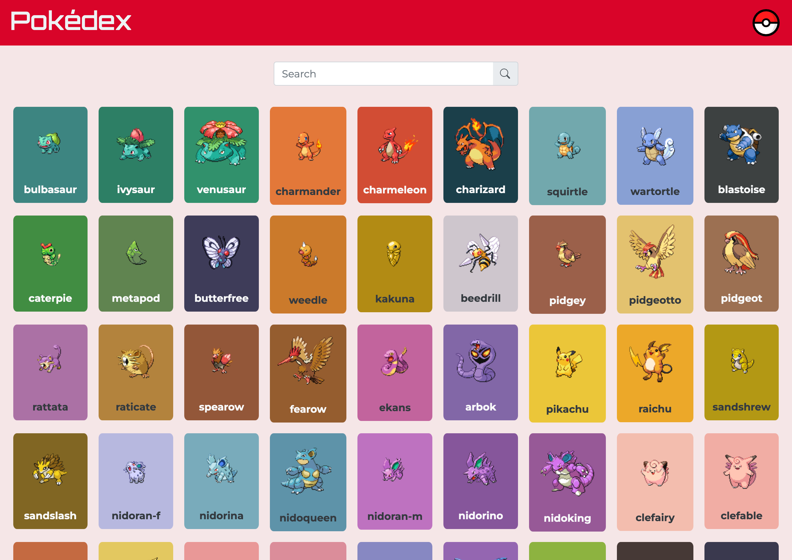
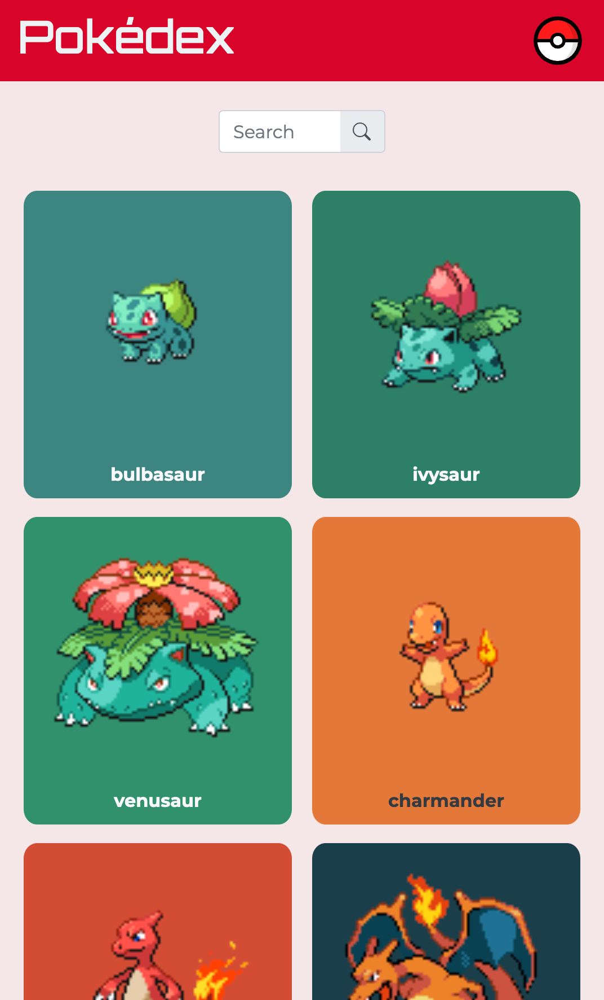
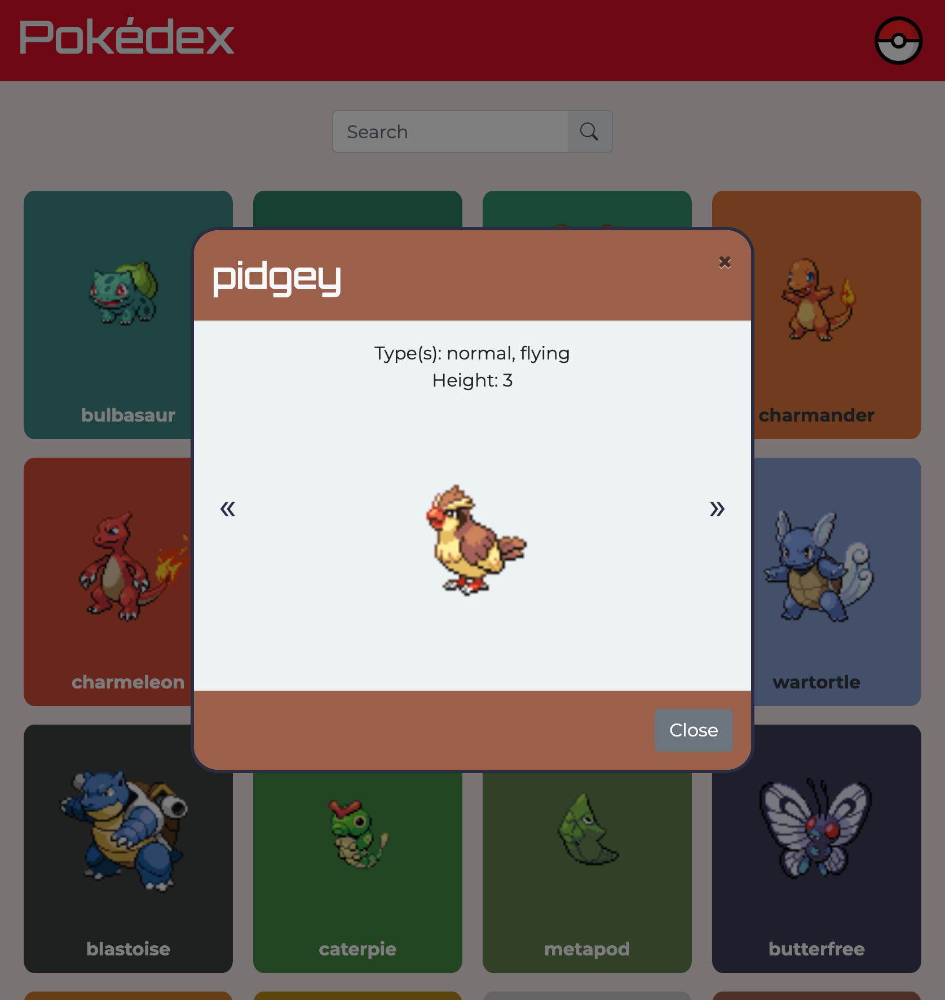

# Pokédex - A Simple Javascript App

## Description

Pokédex is a simple web application that displays a list of Pokémon fetched from the PokéAPI. The app allows users to view a list of Pokémon and access detailed information for each Pokémon, including their name, type, height, and an image. The detailed information is displayed in a modal window, making it easy to explore each Pokémon's attributes.

This project was developed as part of my learning journey in JavaScript and Full Stack Web Development at CareerFoundry.

## Screenshots

## Live Site

Check out the live version of the app [here](https://margaux-works.github.io/simple-js-app/)

## Key Features

- **Dynamic Pokémon List:** Data is fetched in real-time from the PokéAPI, ensuring an up-to-date list of Pokémon.
- **Responsive Design:** The app is fully responsive, ensuring optimal display on devices of all sizes.
- **Interactive UI:** The app features interactive buttons for navigation and Pokémon selection. - **Detailed Pokémon Information:** View detailed information about each Pokémon in a clean and accessible modal.
- **Modular JavaScript (IIFE):** The app’s JavaScript code is organized using Immediately Invoked Function Expressions for better encapsulation and modularity.
- **Bootstrap Integration:** Utilizes Bootstrap 4.3.1 for components.
- **Color Thief Library:** Extracts prominent colors from Pokémon images to enhance UI elements. - **List.js Integration:** Adds dynamic search functionality to the Pokémon list.

## Technologies Used

- JavaScript
- HTML5 & CSS3
- Bootstrap 4.3.1
- List.js
- Color Thief
- PokéAPI
- GitHub Pages for deployment

## Requirements

- The app must load data from an external API; for instance, the Pokémon API.
- The app must display a list of items loaded from that API after the page is loaded.
- The app must enable the viewing of more details for a given list item (like a Pokémon) on
  demand, such as when clicking on a list item.
- The app must have CSS styling.
- The JavaScript code must be formatted according to ESLint rules.
- The JavaScript code may be formatted via Prettier.
- The JavaScript code may be manually formatted.
- The app must use at least one additional complex UI pattern, such as a modal, for details or
  touch interactions.
- The app may allow searching for items (e.g., searching for Pokémon).
- The app must not throw any errors when being used.
- The app should be deployed to a publicly accessible platform like GitHub Pages (you can
  review how to do this in Intro to Frontend Development's Exercise 10: Code Quality, Testing, &
  Web Hosting).
- The app must work in Chrome, Firefox, Safari, Edge, and Internet Explorer 11.

## API

Pokémon data is fetched from the [PokéAPI](https://pokeapi.co/about). For more information on the API and available endpoints, visit their official documentation.

## Contributing

Contributions are welcome! If you'd like to improve this project, please fork the repository and submit a pull request.

1. Fork the repository.
2. Create a new branch **(git checkout -b feature-branch).**
3. Make your changes and commit them **(git commit -m 'Add new feature').**
4. Push to the branch **(git push origin feature-branch).**
5. Open a Pull Request.

## License

This project is for educational purposes and is not intended for commercial use. Pokémon and all related content are trademarks of the Pokémon Company. For more information, visit the official [Pokémon website](https://www.pokemon.com/us).
